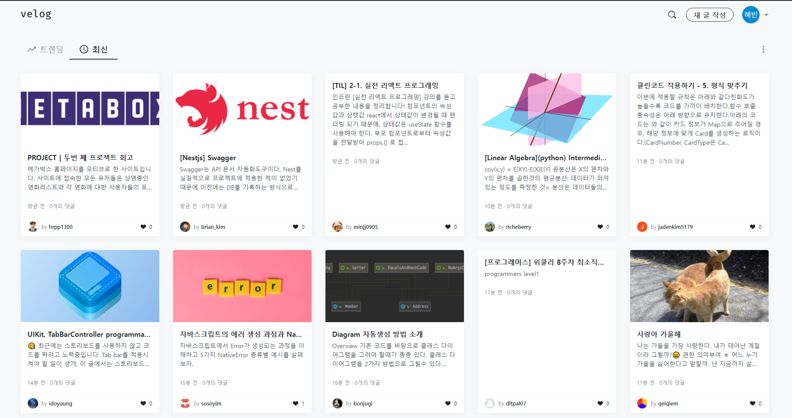
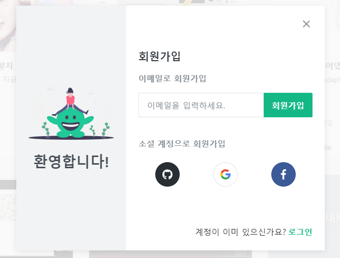
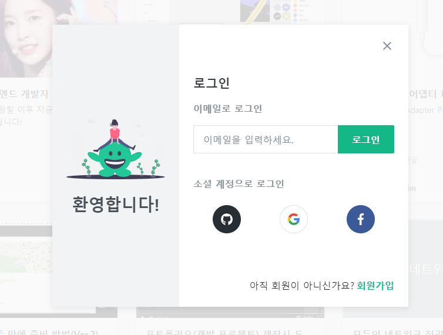
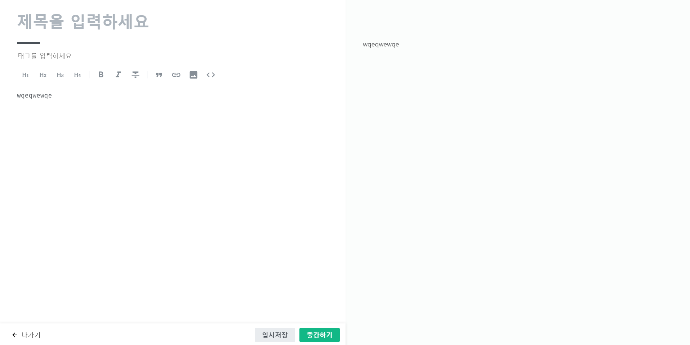

# velog 클론코딩 (10.04 ~ 10.25)

## 1. 글 목록 화면

- 결과 화면
  

- 기능 명세서

  - DB에 저장된 글을 가지고 온다.
  - 최신순 또는 인기순으로 정렬되게 한다.
  - 무한스크롤 기능

## 2. 회원가입 화면

- 결과 화면
  

- 기능 명세서
  - 이메일과 비밀번호를 입력해서 회원가입되게 한다.
  - 소셜 계정 연동은 시간남으면 하는걸로...

## 3. 로그인 화면

- 결과 화면
  

- 기능 명세서
  - 이메일과 비밀번호를 입력해서 로그인처리를 한다. (세션 인증 방식을 사용)
  - 소셜 계정 연동 (구글, 카카오)

## 4. 글 작성 화면

- 결과 화면
  

- 기능 명세서
  - 마크다운 형식을 사용해서 글 작성을 한다.
  - 오른쪽화면에는 미리보기가 지원되어야한다.
  - 해시태그 기능이 있어야한다.
  - 썸네일 기준은 가장 먼저 업로드한 이미지로한다.
  - 임시저장 기능은 시간이 남으면...

## 5. 특정 글 화면

- 결과 화면
  

- 기능 명세서
  - 특정 글에 대한 내용들이 다 나와야한다.
  - 이 글이 내가 쓴 글이면 수정 및 삭제 할 수 있어야함

## 6. 기술 스택

